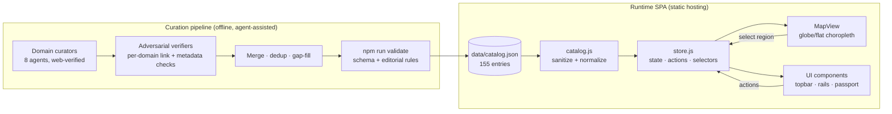

# The Dataset Atlas — System Design

*Version 1.0 · July 2026 · companion to [the concept & research doc](dataset-atlas-concept-and-research.md)*

## 1. Problem and goals

Finding a dataset today means knowing *where to look* first (Kaggle? World Bank? WHO? a national portal?), then searching each source separately. A typical discovery-to-download journey costs 15–30 clicks across 3–4 tabs, and data outside the user's home region is effectively invisible.

**Product goal:** one interface where any user reaches a relevant dataset — view, visit, download — in **≤3 clicks: Region → Domain → Get**.

**Engineering goals:**

| Goal | Decision it drove |
|---|---|
| Zero-friction entry, instant load | Static SPA, no login, no landing page |
| Deployable anywhere for free | No build step, no server, no external runtime services |
| Works offline / air-gapped demos | All assets vendored locally (D3, TopoJSON, catalog) |
| Trustworthy catalog | Every entry link-verified twice; runtime sanitization as defense-in-depth |
| Maintainable by one person | SOLID module architecture, unit tests, CI, drift-prevention tests |

## 2. High-level architecture

The system has two planes: an **offline curation pipeline** that produces the catalog, and a **runtime SPA** that renders it. There is no backend — the "API" is a static JSON file.



## 3. Runtime module design

`js/main.js` is the composition root — the only module that knows every piece. Everything else depends on narrow interfaces.

```
js/
  config.js          registries: domains, regions, source types, presets, colors
  icons.js           inline SVG icon registry (stroke style, no emoji)
  store.js           single source of truth: state, actions, selectors, pub/sub
  catalog.js         loading + sanitization choke point
  filters.js         composable facet predicates + faceted counting
  dna.js             dataset "DNA" scoring (5 normalized metrics)
  manifest.js        Data Passport shell-script generation
  lib.js             adapter over vendored d3/topojson globals
  utils/             pure helpers (esc, oneLine/oneLineUrl, hashId, normFormat; $/el)
  services/          ports: pins storage (localStorage), clipboard, toast
  map/projections.js globe/flat strategies behind one interface
  map/map-view.js    map rendering + drag/zoom/auto-rotate/focus
  ui/                topbar, domain dock, filter rail, card rail, passport drawer, tooltip
  main.js            composition root (dependency injection happens here)
scripts/
  atlas-mcp.js       agent interface: zero-dependency stdio MCP server (see §12)
```

**How SOLID lands here:**

- **Single responsibility** — each module has one reason to change; UI components own one panel each.
- **Open/closed** — a new domain, preset, source type, or map projection is a registry entry (`config.js`, `projections.js`), not a code edit.
- **Liskov substitution** — both projection strategies satisfy one documented contract (`create/baseScale/rotate/applyDrag/isVisible/focusLat/halfHeightRatio` + capability flags); MapView consumes it blindly.
- **Interface segregation** — components see only the store's `getState / select / actions / subscribe`; they never import each other.
- **Dependency inversion** — persistence, clipboard, and notifications are injected ports, so the store is unit-tested with fakes.

### State management

A ~120-line hand-rolled pub/sub store (no framework):

- **State**: `domain`, `sourceTypes`, `formats`, `minOpenness`, `search`, `region`, `preset`, `projection`, `passportOpen`, `pins`.
- **Actions** mutate state, persist side effects through injected ports, then `notify()`. Cross-cutting rules live in actions (e.g. selecting a region closes the passport drawer; changing domain clears a mismatched preset).
- **Selectors** derive filtered lists and faceted counts on demand — with a 155-entry catalog, recomputation is microseconds; no memoization needed.
- **Rendering**: components build static DOM once and update counts/classes in place on each notify, so keyboard focus and scroll positions survive re-renders. The card rail keys its rebuild on a signature of all filter inputs, letting pin toggles skip the rebuild entirely.

### Map rendering

- D3 `geoOrthographic` (draggable globe with ambient auto-rotation until first pointer interaction) and `geoNaturalEarth1` (flat, horizontal rotation + clamped vertical pan) behind the strategy interface.
- Countries are a **choropleth of region-level data availability**: fill = ramp(√(regionCount/maxCount)) recomputed live on every filter change. The ramp's hue follows the **active domain** (Agriculture paints greens, Climate blues — single-hue tint→shade derived from the validated domain color, cached per domain+theme), and the legend gradient/label follow it. Region nodes are sized by √count, colored by the active domain, with counts in solid pill badges.
- Selecting a region tweens rotation (shortest longitude arc) — and in flat mode a vertical pan — to center it.
- Country→region mapping is precomputed (`data/country-regions.json`, ISO-numeric → region) from UN M49 region data, so the runtime does no geometry classification.

## 4. Data model

One catalog entry (validated by `js/catalog.js` at load and `npm run validate` at edit time):

```json
{
  "title": "…", "description": "…",
  "domain": "climate|health|economy|agriculture|education|transport|energy|demographics",
  "region": "global|north-america|latin-america|europe|africa|middle-east|asia|oceania",
  "source": "World Bank", "sourceType": "kaggle|intl-org|gov-portal|research|ngo",
  "url": "https://… (deep link to the dataset page, never a portal homepage)",
  "kaggleRef": "owner/slug  (Kaggle only, regex-whitelisted)",
  "formats": ["CSV", "API"], "license": "CC BY 4.0", "licenseOpenness": 0.8,
  "freshnessYear": 2025, "coverageStart": 1960, "coverageEnd": 2024,
  "granularity": "country|admin|city|point|grid", "approxSizeMB": 270,
  "countries": ["IN"]
}
```

`countries` (optional, ≤4 ISO alpha-2 codes) marks datasets specific to identifiable countries. Clicking a country on the map opens its region with that country's datasets sorted first and badged, and the hover tooltip shows the country-specific count — so country-level coverage is visible even though the atlas navigates by region.

The five **DNA metrics** (freshness, coverage span, granularity, size, license openness) are pure functions of these fields (`js/dna.js`), normalized to (0, 1] so any two datasets compare visually.

## 5. Catalog pipeline (how entries get in)

1. **Curate** — one agent per domain proposes 12–15 real datasets with regional spread, fetching every URL to confirm it resolves to the dataset's own page.
2. **Adversarially verify** — a second, skeptical agent re-fetches every URL, cross-checks Kaggle refs, corrects license/coverage/freshness fields, and drops anything unverifiable. (In practice this pass corrected stale metadata and caught dead links that hand-curation missed.)
3. **Merge** — dedup by normalized URL, fill regional gaps, write `data/catalog.json`.
4. **Gate** — `npm run validate` re-runs the app's own sanitizer plus editorial rules (no duplicate URLs, kaggleRef↔URL consistency, coverage sanity, domain/region coverage matrix). CI runs it on every push.

## 6. Security model

The catalog is treated as **third-party data** even though it's committed to the repo — the daily refresh job writes to it from live source APIs, so defense-in-depth at the load boundary is not optional.

| Surface | Control |
|---|---|
| DOM injection (XSS) | Every catalog string interpolated into `innerHTML` passes `esc()`; icons come from a fixed registry |
| `href` injection | Sanitizer rejects any URL not matching ``^https?://[^\s\x00-\x1f\x7f"'<>\\`]+$`` — no `javascript:`, no control bytes, no quote/angle/backtick characters that could break out of an attribute |
| Clipboard → terminal | URLs are whitespace/control-free end to end; C0/DEL bytes (ANSI escape injection) rejected at load |
| Exported shell manifest | Runs as a script, so: `kaggleRef` must match `^[\w.-]+/[\w.-]+$` or it's dropped; prose fields pass `oneLine()` (strips `\r\n#`); URLs pass `oneLineUrl()` (strips `\r\n`, keeps fragments); tests assert every non-command line is a comment |
| localStorage | Parse failures and quota errors are non-fatal; stored pin ids are pruned against the live catalog at boot |

## 7. UX and accessibility decisions

Modeled on farmlandatlas.com's interaction grammar: the map is the persistent stage; layers/filters are toggles, never navigation; global controls on top; counts everywhere so a click's yield is known before clicking; presets in front of full filters (progressive disclosure).

- Keyboard: region nodes are `role="button"`/`tabindex=0` (Enter/Space select); `/` opens search; `Esc` closes panels in stacking order. The map SVG is `role="group"` so injected buttons keep their semantics.
- `prefers-reduced-motion` disables auto-rotation and all animations.
- Toast is an `aria-live` region; drawers carry dialog roles; the collapsed rail leaves the tab order via `visibility: hidden`.
- Iconography is a single inline-SVG stroke set (`js/icons.js`) — consistent weight and sizing, tinted by each context's accent, no emoji.
- Two themes (light default, dark toggle, persisted): a `THEMES` registry in config mirrored by CSS tokens. Both categorical domain palettes and both sequential choropleth ramps were validated computationally (CVD adjacent-pair separation, lightness bands, surface contrast, ramp monotonicity); a CI test fails on config↔CSS drift.
- Boot failures (file://, missing vendor, data fetch) surface a static fallback via a classic-script watchdog that module-graph errors can't bypass.

## 8. Testing and CI

- **74 unit tests** (`node --test`, zero dependencies) over the pure modules: sanitizer (including injection and country-tag cases), facet predicates, manifest hardening, DNA scoring, store behavior (country-focus ordering, pin import, starter bundles), URL-hash state round-trips, citation/BibTeX generation, access-signal detection, the MCP tool handlers (facet queries, ranking, passport artifacts, and that manifests stay hardened through the agent path), and a **theme-drift test** that fails CI if CSS and config accent colors diverge.
- **Live verification** during development: every feature exercised in a real browser (projections, filters, pinning, manifest export, keyboard paths, mobile layout).
- **CI** (GitHub Actions): syntax-check every module → unit tests → catalog validation. No install step — the pipeline is as dependency-free as the app.
- Three adversarial multi-agent review rounds (4 lenses each, findings verified by independent skeptic agents before being acted on) ran during development; 30 confirmed findings were fixed.

## 9. Performance characteristics

- **Payload**: ~110 KB world topology + ~90 KB catalog + ~280 KB vendored D3 (all cacheable, no CDN dependency). First paint is the static shell; the map renders as soon as three parallel fetches resolve.
- **Interaction**: filter changes trigger cheap in-place updates (attribute/text writes + one fill recompute over 177 country paths). Full path regeneration happens only on drag/zoom/rotate frames, which the 110m-resolution topology sustains comfortably.
- **Memory**: the whole dataset lives in one in-memory array; selectors recompute rather than cache.

## 10. Constraints and non-goals (v1)

- No server-side search or personalization — the catalog ships whole (fine to ~5k entries; beyond that, pre-computed indexes or a search service would be warranted).
- No real-time freshness — counts and metadata update when the daily refresh regenerates the catalog file (§11), not on every page load.
- Single language (English), single catalog edition.

## 11. Catalog lifecycle: how it stays current

The catalog has two update paths — one automated, one editorial — both funneled through the same validate gate, so nothing reaches `main` (or the deployed site) unvalidated.

**Daily automated refresh** (`scripts/refresh-catalog.js` + `refresh.yml`, 05:00 UTC and on demand):

| Step | What happens | Architectural note |
|---|---|---|
| Liveness sweep | Every URL fetched and classified ok / bot-blocked / dead / transient; `ok` entries get a `verified` date stamp (the shield badge on cards) | 8 concurrent workers; bot walls (401/403/405/406/429) count as alive |
| Freshness enrichment | Source metadata APIs report last-modified dates; `freshnessYear` bumps when the source is newer (living series also extend `coverageEnd`) | An adapter registry — World Bank, CKAN portals, GitHub, figshare, Kaggle (behind optional `KAGGLE_USERNAME`/`KAGGLE_KEY` secrets, silent skip without). New host family = one entry |
| Ship or escalate | Safe metadata changes auto-commit to `main` behind the validate + test gate and redeploy; dead links open a review PR and turn the run red | Machine-verifiable changes need no human; replacing a dataset does |

**Editorial growth** — new entries come from the agent-assisted curation rounds in §5 (curate → adversarially verify → validate), run on demand. This is deliberate: whether a dataset *belongs* in the atlas is a judgment call, so it is not automated.

The runtime is untouched by all of this — it still just fetches one static JSON file; `generated` and per-entry `verified` stamps are how the automation surfaces in the UI.

## 12. Agent interface (MCP)

The catalog is machine-readable ground truth, so the same data that powers the map also powers agents. `scripts/atlas-mcp.js` is a single-file, **zero-dependency** stdio [MCP](https://modelcontextprotocol.io) server (hand-rolled newline-delimited JSON-RPC 2.0, matching the repo's no-install ethos) that any MCP client — Claude Code, Claude Desktop, an Agent SDK agent — mounts as a dataset-discovery tool.

**Design principle: the server is a thin façade, never a fork.** Each tool body calls the app's own pure modules, so an agent's results are byte-identical to the UI's and there is no second copy of the filtering, scoring, sanitization, or manifest logic to drift.

| Tool | Backed by | Returns |
|---|---|---|
| `search_catalog` | `filterCatalog` (js/filters.js) + `dnaMetrics` (js/dna.js) | Faceted, ranked entries (domain/region/country/license/format/size) with 0–1 DNA scores |
| `get_dataset` | `dnaMetrics` + the entry | Full metadata, DNA detail with notes, download command, share link |
| `list_bundles` | `PRESETS` (js/config.js) | The curated 5-dataset starter kits with resolved ids |
| `build_passport` | `manifestText` (js/manifest.js) + `bibliographyFor` (js/citation.js) | `data-passport.sh`, `references.bib`, and a pre-pinned share link |

The catalog still flows through `buildCatalog` (the §6 sanitizer) whether it is read from the local `data/catalog.json` or fetched from the live GitHub Pages copy, so the security model is unchanged — an agent cannot reach an unsanitized entry, and every manifest string is shell-hardened exactly as in the browser. The **acquisition/preparation half stays in the client agent** (download via the Kaggle CLI or the URL, then profile and join): the atlas does discovery and the reproducible hand-off, mirroring the July-2026 MCP ecosystem where discovery, acquisition, and preparation are composed from separate servers. The [`expedition`](../.claude/skills/expedition/SKILL.md) skill encodes the six-step flow (clarify → search → rank by DNA → assemble → package → hand off) that drives these four tools.
